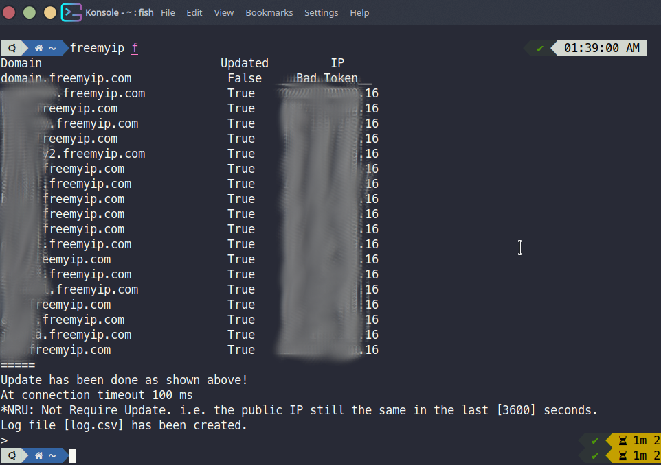

# freemyip-python
Simple Python3 script to update [Freemyip.com](https://freemyip.com) dynamic DNS.

# Usage
 1. Clone or download the repo.
 2. Fill `tokens.csv` file with your domain & token in csv format using any text editor like the following:
 
       ```
       domain1.freemyip.com,TOKEN_OF_DOMAIN1
       domain2.freemyip.com,TOKEN_OF_DOMAIN2
       ```
 3. Run the script `python3 freemyip.py`
 4. The script could able to show the last log data without update using `log` as a parameter. i.e:
 
      ```
      python3 freemyip.py log
      ```
 5. Showing log file path:
 
    ```
    python3 freemyip.py logpath
    ```
 6. **New** Setting the connection timeout in milli seconds. The default value is 100 ms.
    ```
    python3 freemyip.py t=140
    ```
 7. **New** Force update and force update with timeout
    ```
    python3 freemyip.py f
    python3 freemyip.py ft=140
    ```
 8. Help parameter h
    ```
    python3 freemyip.py h
    ```
 
 **Hint**: The above command can be added to crontab in Linux-based operating systems or any equivalent tool in other operating systems to keep automatic host update.

 # TODO
 ~~Introducing flooding requests inhibition on freemyip.com server, by identifying the current public IP of the host using third party api and comparing it with the last recorded log IP and last update time. In other words, if the host IP has not been changed in the last hour, for example, the updating of the specified domain will not occure.~~

 Now TODO has been done using [ipify.org](https://www.ipify.org) api to identify the current public IP of the host.
 
 
 ### Screenshots
 
 
